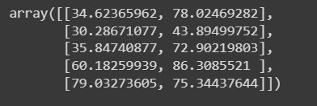
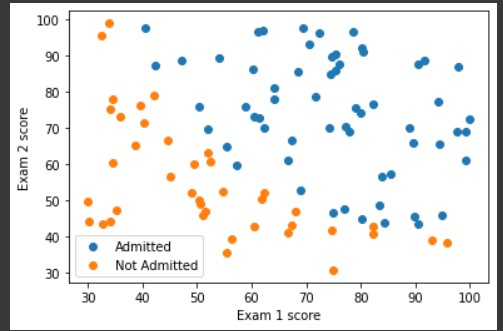
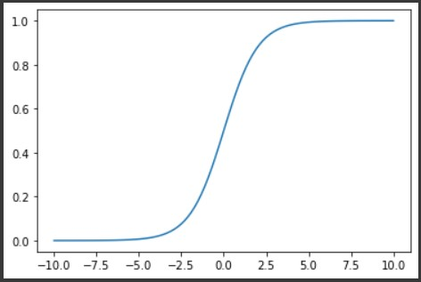

# Implementation-of-Logistic-Regression-Using-Gradient-Descent

# AIM:
To write a program to implement the the Logistic Regression Using Gradient Descent.

# Equipments Required:
1. Hardware – PCs
2. Anaconda – Python 3.7 Installation / Jupyter notebook

# Algorithm
### Step1:
Use the standard libraries in python for finding linear regression.
### Step2: 
Set variables for assigning dataset values.
### Step3: 
Import linear regression from sklearn.
### Step4: 
Predict the values of array.
### Step5:
 Calculate the accuracy, confusion and classification report by importing the required modules from sklearn.
### Step6: 
Obtain the graph.

# Program:
```
/*
Program to implement the the Logistic Regression Using Gradient Descent.
Developed by: Saravana Kumar S
RegisterNumber: 212221230088
*/
```
```python
import numpy as np
import matplotlib.pyplot as plt
from scipy import optimize

data=np.loadtxt("ex2data1.txt")
x=data[:,[0,1]]
y=data[:,2]

x[:5]

plt.figure()
plt.scatter(x[y==1][:,0],x[y==1][:,1],label='Admitted')
plt.scatter(x[y==0][:,0],x[y==0][:,1],label='Not Admitted')
plt.xlabel("Exam 1 score")
plt.ylabel("Exam 2 score")
plt.legend()
plt.show()

def sigmoid(z):
  return 1/(1+np.exp(-z))

plt.plot()
x_plot=np.linspace(-10,10,100)
plt.plot(x_plot,sigmoid(x_plot))
plt.show()

def costfunction(theta,x,y):
  h=sigmoid(np.dot(x,theta))
  j=-(np.dot(y,np.log(h))+np.dot(1-y,np.log(1-h)))/x.shape[0]
  grad=np.dot(x.T,h-y)/x.shape[0]
  return j,grad

x_train=np.hstack((np.ones((x.shape[0],1)),x))
theta=np.array([0,0,0])
j,grad=costfunction(theta,x_train,y)
print(j)
print(grad)

x_train=np.hstack((np.ones((x.shape[0],1)),x))
theta=np.array([-24,0.2,0.2])
j,grad=costfunction(theta,x_train,y)
print(j)
print(grad)

def cost(theta,x,y):
  h=sigmoid(np.dot(x,theta))
  j=-(np.dot(y,np.log(h))+np.dot(1-y,np.log(1-h)))/x.shape[0]
  return j

def gradient(theta,x,y):
  h=sigmoid(np.dot(x,theta))
  grad=-(np.dot(x.T,h-y)/x.shape[0])
  return grad

x_train=np.hstack((np.ones((x.shape[0],1)),x))
theta=np.array([0,0,0])
res=optimize.minimize(fun=cost,x0=theta,args=(x_train,y),method='Newton-CG',jac=gradient)
print(res.fun)
print(res.x)

def plotdecisionboundary(theta,x,y):
  x_min,x_max=x[:,0].min()-1,x[:,0].max()+1
  y_min,y_max=x[:,1].min()-1,x[:,1].max()+1
  xx,yy=np.meshgrid(np.arange(x_min,x_max,0.1),
                    np.arange(y_min,y_max,0.1))
  x_plot=np.c_[xx.ravel(),yy.ravel()]
  x_plot=np.hstack((np.ones((x_plot.shape[0],1)),x_plot))
  y_plot=np.dot(x_plot,theta).reshape(xx.shape)

  plt.figure()
  plt.scatter(x[y==1][:,0],x[y==1][:,1],label='Admitted')
  plt.scatter(x[y==0][:,0],x[y==0][:,1],label='Not Admitted')
  plt.xlabel("Exam 1 score")
  plt.ylabel("Exam 2 score")
  plt.legend()
  plt.show()

plotdecisionboundary(res.x,x,y)
prob=sigmoid(np.dot(np.array([1,45,85]),res.x))
print(prob)

def predict(theta,x):
  x_train=np.hstack((np.ones((x.shape[0],1)),x))
  prob=sigmoid(np.dot(x_train,theta))
  return(prob>=0.5).astype(int)
np.mean(predict(res.x,x)==y)

```
# Output:
### Array of X:

### Array of Y:

### Graph:

### Sigmoid function:

### X_train grad:

### y_train grad:

### Print res:

### Decision Boundary:

### Probability value:

### Prediction value of mean


# Result:
Thus the program to implement the the Logistic Regression Using Gradient Descent is written and verified using python programming.

